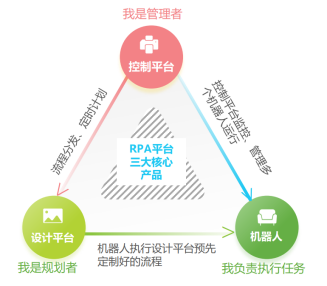
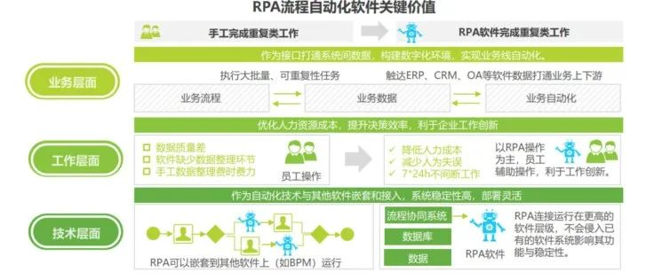
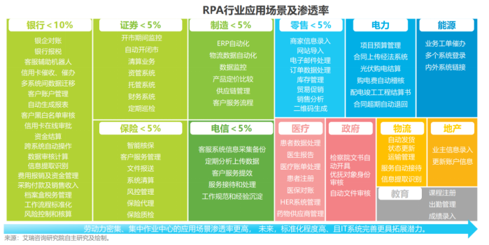
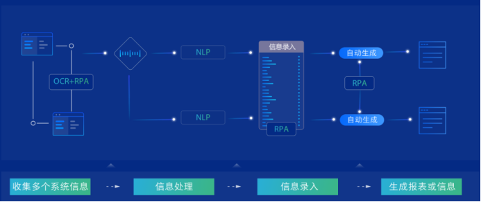

# RPA

## 介绍
RPA是Robotic Process Automation的简称，中文翻译为机器人流程自动化，是指模拟人在计算机上操作，利用各项技术减少重复繁重的工作，实现业务流程自动化的机器人软件。例如，在银行的业务流程中，通常有纸质文件输入、文件票据验证、从电子邮件和文件中提取数据、跨系统数据迁移、自动化IT应用操作等。这些工作可以由软件机器人准确快速地完成，可以减少人为错误，确保零错误，提高效率，并大大降低运营成本。RPA依靠先进的软件自动化技术，大大降低开发成本和开发周期，实现银行内部跨系统和工作流程的自动化，提高生产力，降低成本。
* Robotic：机器人技术
* Process：流程
* Automation：自动化  

## RPA的优势
RPA可以在很多领域发挥重要作用，包括金融流程自动化、办公自动化、IT流程自动化、自动网络数据采集、自动订单处理等。使用RPA的主要优势有以下几点。  
1. 减少劳动成本： 通过软件自动化脚本反复实现人工任务的自动化操作，不再需要大量的人力，只需要少数业务经理和运维人员。
2. 提高生产力：RPA可以实现全天候工作，高效执行。
3. 出错率低：根据明确的规则进行操作，无差异化，尽可能地消除人为错误。
4. 可监控的操作：协助公司优化其流程。机器人的每个步骤都可以被监控和记录，这有助于企业改善其流程，同时保持丰富的审计线索。
5. 周期短：一些流程自动化可以通过改造现有的企业办公系统来完成，允许多个系统提供API接口，然后基于SOA架构也可以完成。然而，这需要巨大的财政资源和较长的周期来完成这种整合。相比之下，RPA自动化可以通过自动化脚本快速建立自动化流程，在短时间内产生效益。
6. AI技术的成熟，让RPA如虎添翼：机器学习，自然语言处理，OCR识别等AI技术，让机器人能够处理更多工作。
7. 人力成本越来越高，企业有使用RPA的动力：通过自动化的技术可以降低人力成本，RPA可以24小时工作，可以多台计算机并行。
8. 助力企业数字化转型：随着企业不断推进数字化转型，RPA可以几百倍的提升数据的录入速度，让企业业务数据化，通过流程自动化可以协助企业数字化转型。  

RPA不只是单纯的技术创新，而是创造了一种新的技术应用模式，是一种新的人机交互方式和协作方式。

RPA平台一般由设计平台、机器人、控制平台组成。设计平台主要完成可视化的流程编辑工作，设计平台的演变趋势是引入低代码技术，让流程设计门槛更低。机器人则是在设计平台流程完成设计后自动执行操作，通常无人值守，少数情况下需要人工干预。控制平台主要协调管理机器人运行，合理分工，控制风险。

RPA系统架构

#### 1、RPA和IPA
智能过程自动化（IPA）是用于管理和自动化数字流程的技术的组合。IPA应提高运营效率、员工绩效和响应客户的效率。它们还应降低运营风险，目标是创造有效的运营环境。

IPA旨在通过执行以前由人类执行的手动、重复和常规任务来帮助人类工作者。IPA中结合的技术包括机器人过程自动化（RPA）、人工智能（AI）、机器学习和数字过程自动化（DPA）。

智能过程自动化IPA和机器人过程自动化RPA是相似的过程，RPA通常用于定义的基于规则的进程。相比之下，IPA用于更复杂的操作，IPA首先需要RPA作为基础。

#### 2、卓越中心CoE和PRA
卓越中心（center of excellence，CoE）是一支由熟练知识型员工团队，其使命是为他们工作的组织提供围绕特定感兴趣的领域的最佳实践。为思想领导建立特殊利益集团的概念起源于精益制造。

当组织内部存在知识不足或技能差距时，通常会创建CoE。例如，公司可能会组建一个新的卓越中心来管理机器人过程自动化（RPA）的采用和集成。

卓越中心的一个重要目标是消除效率低下，并帮助将组织转移到成熟度模型的下一阶段。CoE应包括管理层、业务线（LOB）和信息技术（IT）的代表。

#### 3、工作流自动化和PRA
工作流自动化（workflow automation）是使任务、文档和信息流跨工作相关活动按照定义的业务规则独立执行的方法。实施时，这种类型的自动化应该是一个简单明了的过程，可以定期执行，以提高日常生产力。

从概念上讲，机器人过程自动化（RPA）与工作流自动化类似。区别在于RPA可用于自动化单个离散任务，而工作流自动化对于自动化一系列相互依赖的任务很有用。工作流自动化和RPA都依赖于技术来自动化任务，但工作流自动化更强调工作流的不同元素之间的通信。

## RPA的分类
1. 辅助自动化：RPA通常部署在用户电脑上，有助于提供更好的用户和客户体验。辅助自动化的缺点是桌面设置上的不一致可能会导致RPA失败。此外，有时在执行自动步骤时，用户的桌面会锁定。
1. 无人值守自动化：无辅助自动化不需要人工干预，RPA软件可自己执行，仅在出现问题时通知用户。
1. 混合RPA：在混合RPA中，人和机器人基本上作为一个团队工作，来回传递任务。混合RPA可自动执行仅由机器人完成的工作，以及涉及非结构化数据或需要员工决策（协助）的工作。在混合RPA中，软件机器人和人可以同时处理不同的任务，以实现最佳效率。

## RPA的价值
RPA软件可自动执行依赖于数字数据的重复、基于规则的工作任务。这些任务包括查询、计算、创建和更新记录、填写表单、生成报表、切割和粘贴以及执行需要在应用程序内部和应用程序之间移动数据的其他大批量事务性任务。  

RPA流程自动化软件关键价值
  

RPA有广泛的使用常见，比如金融行业的对账，清算业务，制造业的ERP自动化，零售业业的信息录入，政府行业的自动文件审核等。  

行业应用场景及渗透率

RPA可以赋能HR、前台、财务等岗位，大幅减少这些行业的重复性工作，让这些岗位可以从事更负责，更高级的工作，以一当十，带来更多价值。

#### 企业使用RPA，可以获得如下收益
- 非侵入部署，适合多种场景，让数字化更深入：RPA模拟人类操作，不需要接入数据库，不需要和软件对接API，适应性更强，部署更灵活，开发更容易。
- 重复工作自动化，大幅提升效率：机器人不需要睡觉，长期工作也不会犯错，将重复的工作交给计算机完成，将大幅提升工作效率。
- 实现多系统联动，优化流程：RPA可以将不同软件打通，实现业务流程自动化，从而优化流程，催进业务创新。

#### 部署RPA的公司可以获得以下优势
- 精确：机器人每次都以相同的方式完成此过程，不会疲劳，从而降低错误率和不一致。
- 合规：RPA跟踪机器人性能并存储数据以审核符合法规和治理要求的法规。它还减少了人与敏感数据的互动，减少了欺诈的可能性。
- 节约成本：自动化提升效率，必然节省成本。
- 工的生产力和士气：重复的、令人费解的任务的自动化使员工能够提高工作效率，并释放他们从事高价值的工作。
- 数字化转型：使用RPA，公司可以自动化部分流程，而无需更改旧系统，或投资于与现有系统进行昂贵且耗时的端到端集成，从而能够推进数字化转型。

## 导致RPA项目失败的风险
根据这项研究，企业常犯的错误是认为RPA是IT项目。由于RPA模仿人类完成与业务流程相关的各种任务，因此RPA实现必须由专家和员工驱动，他们了解流程的步骤，并了解如何通过自动化改进流程。

以下是RPA项目失败的风险：
- 低估人力实施成本：IT全面参与RPA部署至关重要，企业经常低估维护和微调RPA机器人所需的IT专业知识和基础设施。
- RPA的易用性是一项重要风险：流程如果没有正确理解，简单地自动化会带来风险，如果没有对RPA机器人的强有力的治理计划，会造成潜在的风险。
- 安全风险：RPA安全风险确实存在，包括欺诈、对敏感数据的访问不当、能够影响系统可用性和连续性以及滥用管理权限。

## RPA主要厂商
1. Blue Prism：该公司一直专注于以IT为主导的企业部署为受监管行业的组织特别是金融行业提供服务，特点是在桌面运行的机器人，这些机器人是集中定义和管理的。
2. UiPath：该公司的特点是拥有"合作伙伴生态系统，使其能够支持与主要产品和应用程序的集成，涵盖BPM、工艺挖掘和AI。
3. EdgeVerve Systems：该公司是业务流程外包（BPO）供应商Infosys有限公司的全资子公司。产品包括卓越自动化中心、治理和流程发现的框架。
4. NICE：该公司2016年建立了RPA业务线，产品侧重于企业级实施，产品包括参与和无人值守的RPA工作负载。
5. WorkFusion：该公司结合了机器人、AI驱动的认知自动化和劳动力编排，实现了企业业务流程的自动化，其在AI方面拥有优势。 
6. UiBot：专门用于RPA。保留了按键精灵的优点，舍弃了按键精灵中一些过剩的功能，又增加了贴合RPA需要的很多功能。UiBot有社区版，无论内网外网，社区版都可以永久免费使用。

利用自然语言理解、自然语言生成、知识图谱等技术，为客户提供文本自动抽取、审核、纠错、搜索、推荐、写作等智能软件系统，让计算机代替人工完成业务流程自动化，大幅度提高企业效率。
  
结合NLP技术，模拟人工在不同系统中查询操作，自动进行信息收集和提取，生成用户所需报表，自动化录入后续业务系统。

## RPA 与 按键精灵
“按键精灵”，是一个模拟鼠标键盘动作的软件。它们可以模拟鼠标键盘的操作，减少重复性操作，提高效率。当然，还有许多人用来做简单的游戏外挂，在PK中增加胜率。通过制作脚本，可以让按键精灵代替双手，自动执行一系列鼠标键盘动作。按键精灵简单易用，不需要任何编程知识就可以作出功能强大的脚本。只要在电脑前用双手可以完成的动作，按键精灵都可以替代完成。  

如果只是实现界面的自动化，其实按键精灵已经足够强大了。按键精灵在游戏里面使用得比较多，众所周知游戏界面的画面复杂（甚至大部分都是3D的），而且变化快，对自动化的要求很高。  

RPA领域，主要是为了实现办公领域的自动化，办公软件的界面一般比游戏要简单，变化频率也不高，所以在界面自动化方面，RPA的要求反而更低了。但是，RPA的领域比较广，要面对各行各业的业务人员，所以强调流程/脚本编写起来足够简单，最好不要依靠那些面向专业IT人士的编程语言如Python等。而且，RPA要求能够对流程集中管控，要求能够无人值守，等等。
 

## 开源RPA
1. Robot Framework  
Robot Framework是目前比较活跃的开源项目之一，是测试自动化和RPA的通用框架。与其他语言一样，它强调自然语言或人类可读的语言，以使其更易于使用。
Robot Framework还提供了一个web演示和完整的文档。  
RPAPlus实际试用后觉得这个框架可能更偏向于自动化测试。  
- [Generic automation framework for acceptance testing and RPA Github](https://github.com/robotframework/robotframework)
- [Web testing library for Robot Framework](https://github.com/robotframework/SeleniumLibrary.git)  
- [Robot Framework test library for SSH and SFTP](https://github.com/robotframework/SSHLibrary.git)  
- [Test data editor for Robot Framework](https://github.com/robotframework/RIDE.git)  
- [Tools to ease creating larger test libraries for Robot Framework using Python](https://github.com/robotframework/PythonLibCore.git)  
- [RemoteSwingLibrary](https://github.com/robotframework/remoteswinglibrary.git)  
- [Robot Framework remote server implemented with Python](https://github.com/robotframework/PythonRemoteServer.git)

2. TagUI  
TagUI由AI Singapore维护，是一个用于RPA的命令行界面，可以在任何主要的操作系统上运行。(这是开源RPA工具的一个常见特性，也是它与一些商业工具的区别之一。)TagUI使用术语和相关的“流程”概念来表示运行一个基于计算机的自动化流程，该流程可以按需完成，也可以按固定的时间表完成。(通过这种方式，TagUI中的流可能被称为脚本或机器人。)TagUI强调其语言的简单或自然。贡献者Ken Soh在2017年发布的一篇介绍TagUI的媒体文章中写道:“这使得UI自动化的快速原型化、部署和维护变得容易，无论你是否是开发人员。TagUI有丰富的在线文档。  
TagUI的界面是纯命令行。  
[Github](https://github.com/kelaberetiv/TagUI)
[TagUIcn/tagui](https://gitee.com/TagUIcn/tagui.git)

3. RPA for Python  
以前叫做“TagUI for Python”，这是一个用于RPA开发的Python包。RPA for Python是在TagUI上构建的，因此有了最初的名字。它拥有网站自动化、计算机视觉自动化、光学字符识别和键盘鼠标自动化等基本功能。很好地完成UI自动化/RPA的软件包。但与商业RPA软件不同，这个工具只是许多其他软件包的一个组件，Python用户可以与之结合以创建复杂的东西。它更像是一个配角，是用户工具箱中的工具之一。但商业RPA软件更像是用户在数字自动化工作中占据中心舞台和主要软件。
[tebelorg/RPA-Python：](https://github.com/tebelorg/RPA-Python.git)https://github.com/tebelorg/RPA-Python.git

4. OpenRPA  
OpenRPA也是一个蛮有趣的项目，基于Windows Workflow Foundation作为框架。WF被Uipath和许多国内RPA团队应用。  
[Free Open Source Enterprise Grade RPA：](https://github.com/open-rpa/openrpa)https://github.com/open-rpa/openrpa  
[openflow：](https://github.com/open-rpa/openflow.git)https://github.com/open-rpa/openflow.git

5. Robocorp   
Robocorp是早期初创公司，承诺为开发人员提供基于云的开源RPA工具。[官网](https://robocorp.com/)目前可以通过邮件申请早期账号。

6. Automagica  
这可能是开源模式和免费增值模式之间的分界线：Automagica确实是开源的，对于非商业用途是免费的，但是商业用途需要商业许可证。这使得它成为希望学习、试验和原型的个人的一个潜在的好选择，但是商业用例将需要迁移到它的商业Automagica门户平。Automagica也有相对全面的介绍文档。  
Automagica的自动化能力实现是基于Python，独立开发了一个云端应用平台，可以实现网页端的编码。  
[Github：](https://github.com/automagica/automagica)https://github.com/automagica/automagica

7. Taskt
Taskt强调易用性和无代码或低代码。Taskt是一个免费的开源工具，它承诺了同样的功能:无需编写代码就可以自动执行任务。它的功能之一是屏幕记录器，记录用户基于计算机的操作，然后将这些步骤转换成可重复的脚本(也称为RPA bot)。它还包括一个“看到什么就得到什么”的“bot设计器”，其中包含一个用于无代码RPA开发的标准命令菜单。  
[Github：](https://github.com/saucepleez/taskt)https://github.com/saucepleez/taskt   

## 参考资料
1. RPA 终极指南：
https://searchcio.techtarget.com/Ultimate-guide-to-RPA-robotic-process-automation
2. 使用RPA for Python案例 [RPA for Python](rpaforpython_framework/RPA%20for%20Python.md)