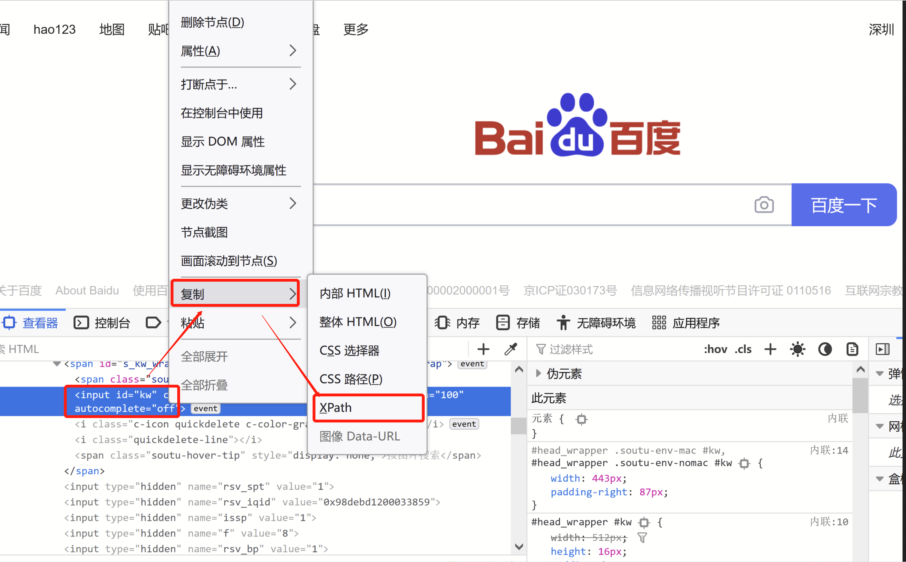

# RPA Python
## 介绍
RPA for Python简单而强大的API让机器人流程自动化变得有趣，可以使用它快速自动化网站、桌面应用程序或命令行上重复的耗时任务。
[TagUI手册](https://tagui.readthedocs.io/en/latest/index.html)
[GitHub地址](https://github.com/tebelorg/RPA-Python)
[TagUI Windows版下载地址](https://github.com/kelaberetiv/TagUI/releases/download/v6.46.0/TagUI_Windows.zip)

## 安装
1. 将下载好的TagUI v6.46 for Windows解压放在C:\Users\Administrator\AppData\Roaming（%APPDATA%\tagui）文件夹下
2. 安装[OpenJDK for Windows](https://corretto.aws/downloads/latest/amazon-corretto-8-x64-windows-jdk.msi)
3. pip install -r requirements.txt

### Xpath获取方式

## 错误
[RPA][ERROR] - following happens when starting TagUI...

